# Sơ Đồ Kiến Trúc Hệ Thống - Payment Sandbox API

**Phiên bản**: 1.1.0  
**Ngày tạo**: 2024  
**Mô tả**: Tài liệu mô tả chi tiết kiến trúc, luồng dữ liệu và cách hoạt động của hệ thống

---

## Mục Lục

1. [Tổng Quan Kiến Trúc](#1-tổng-quan-kiến-trúc)
2. [Sơ Đồ Kiến Trúc Tổng Quan](#2-sơ-đồ-kiến-trúc-tổng-quan)
3. [Luồng Xử Lý Request](#3-luồng-xử-lý-request)
4. [Kiến Trúc BIN Lookup](#4-kiến-trúc-bin-lookup)
5. [Kiến Trúc Card Generation](#5-kiến-trúc-card-generation)
6. [Kiến Trúc ETL Pipeline](#6-kiến-trúc-etl-pipeline)
7. [Kiến Trúc Cache Multi-Tier](#7-kiến-trúc-cache-multi-tier)
8. [Kiến Trúc Bảo Mật](#8-kiến-trúc-bảo-mật)
9. [Kiến Trúc Database](#9-kiến-trúc-database)
10. [Các Thành Phần Chính](#10-các-thành-phần-chính)

---

## 1. Tổng Quan Kiến Trúc

### 1.1. Kiến Trúc Tổng Thể

Hệ thống được xây dựng theo mô hình **3-tier architecture** với các lớp:

- **Presentation Layer**: REST API, WebSocket
- **Application Layer**: Business Logic, Services, Controllers
- **Data Layer**: PostgreSQL, Redis, File System

### 1.2. Công Nghệ Sử Dụng

- **Runtime**: Node.js 18+
- **Framework**: Express.js
- **Language**: TypeScript (strict mode)
- **Database**: PostgreSQL 15+
- **Cache**: Redis 7+ + In-memory LRU
- **Queue**: Bull Queue (Redis-based)
- **Process Manager**: PM2
- **Monitoring**: Prometheus metrics

---

## 2. Sơ Đồ Kiến Trúc Tổng Quan

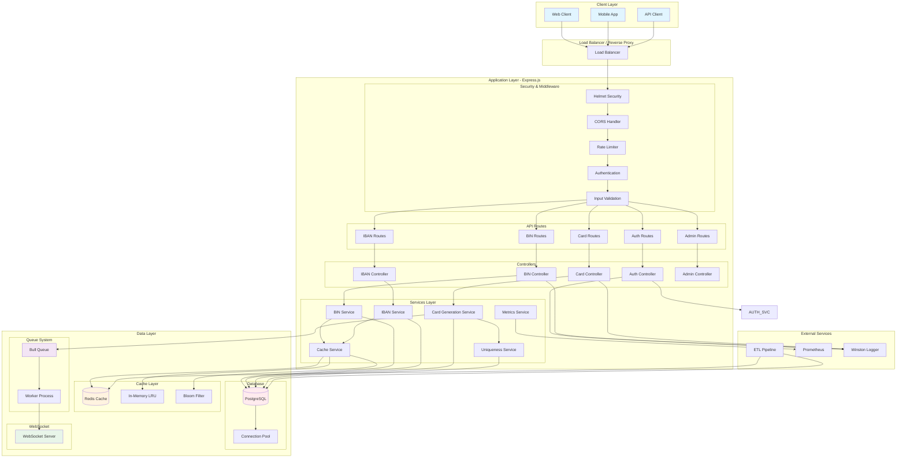

### 2.1. Giải Thích Các Thành Phần

#### Client Layer
- **Web Client**: Ứng dụng web frontend
- **Mobile App**: Ứng dụng di động
- **API Client**: Các ứng dụng tích hợp qua API

#### Application Layer
- **Security Middleware**: Bảo vệ hệ thống ở tầng đầu tiên
- **API Routes**: Định tuyến các request đến controller phù hợp
- **Controllers**: Xử lý request, gọi services, trả về response
- **Services**: Business logic chính của hệ thống

#### Data Layer
- **Cache Layer**: Tăng tốc độ truy cập dữ liệu
- **Database**: Lưu trữ dữ liệu chính
- **Queue System**: Xử lý các tác vụ bất đồng bộ
- **WebSocket**: Cung cấp real-time updates

---

## 3. Luồng Xử Lý Request

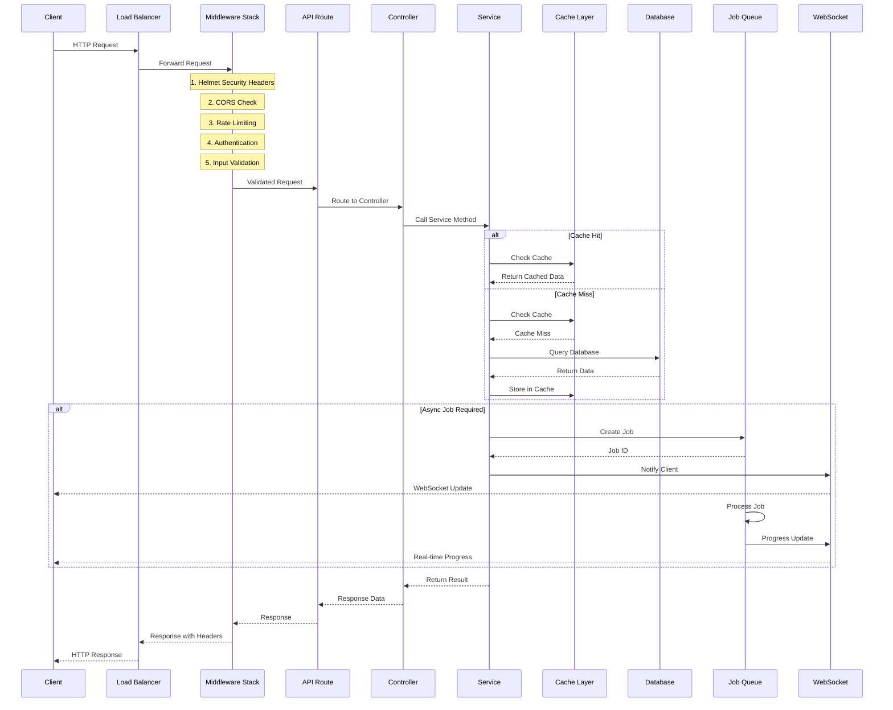

### 3.1. Chi Tiết Luồng Xử Lý

#### Bước 1: Request Nhận Được
- Client gửi HTTP request đến Load Balancer
- Load Balancer phân phối request đến một instance của ứng dụng

#### Bước 2: Middleware Stack
1. **Helmet Security**: Thêm security headers (XSS protection, HSTS, etc.)
2. **CORS**: Kiểm tra và xử lý Cross-Origin requests
3. **Rate Limiting**: Kiểm tra giới hạn số request theo user tier
4. **Authentication**: Xác thực JWT token hoặc API key
5. **Input Validation**: Validate và sanitize input data

#### Bước 3: Routing
- Request được định tuyến đến route handler phù hợp
- Route handler gọi controller tương ứng

#### Bước 4: Business Logic
- Controller gọi service để xử lý business logic
- Service kiểm tra cache trước, nếu miss thì query database
- Kết quả được cache lại để lần sau sử dụng

#### Bước 5: Response
- Kết quả được trả về qua các lớp middleware
- Response headers được thêm vào (rate limit info, request ID, etc.)
- Client nhận được response

---

## 4. Kiến Trúc BIN Lookup

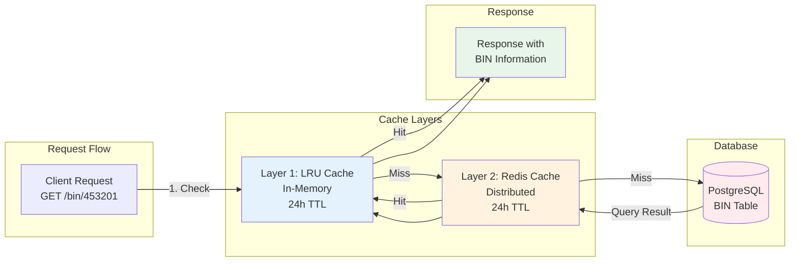

### 4.1. Chi Tiết BIN Lookup Flow

#### Layer 1: LRU Cache (In-Memory)
- **Vị trí**: Trong memory của application instance
- **Kích thước**: 10,000 entries
- **TTL**: 24 giờ
- **Tốc độ**: < 1ms
- **Mục đích**: Cache nhanh nhất cho các BIN được truy cập thường xuyên

#### Layer 2: Redis Cache (Distributed)
- **Vị trí**: Redis server (có thể cluster)
- **TTL**: 24 giờ
- **Tốc độ**: 1-5ms
- **Mục đích**: Cache chia sẻ giữa các application instances

#### Layer 3: Database
- **Vị trí**: PostgreSQL
- **Tốc độ**: 10-50ms (tùy query complexity)
- **Mục đích**: Nguồn dữ liệu chính thức

### 4.2. BIN Service Logic

```typescript
// Pseudocode
async function lookupBIN(bin: string) {
  // 1. Check LRU cache
  const lruResult = lruCache.get(bin);
  if (lruResult) return lruResult;
  
  // 2. Check Redis cache
  const redisResult = await redis.get(`bin:${bin}`);
  if (redisResult) {
    lruCache.set(bin, redisResult); // Update LRU
    return redisResult;
  }
  
  // 3. Query database
  const dbResult = await binModel.findByBIN(bin);
  if (dbResult) {
    await redis.set(`bin:${bin}`, dbResult, 'EX', 86400); // Cache 24h
    lruCache.set(bin, dbResult); // Update LRU
    return dbResult;
  }
  
  // 4. Not found
  return null;
}
```

---

## 5. Kiến Trúc Card Generation

```mermaid
graph TB
    subgraph "Request"
        REQ[POST /cards/generate-async<br/>count: 1000]
    end
    
    subgraph "5-Layer Uniqueness Check"
        L5[Layer 5: Redis Cache<br/>Exact Match Check]
        L4[Layer 4: Bloom Filter<br/>Probabilistic Check<br/>O(1) lookup]
        L3[Layer 3: Uniqueness Pool<br/>Reservation with Lock]
        L2[Layer 2: Global Index<br/>Cross-Partition Check]
        L1[Layer 1: Composite Constraint<br/>Database Level]
    end
    
    subgraph "Generation Process"
        GEN[Generate Card<br/>Number, CVV, Expiry]
        VALIDATE[Validate Luhn<br/>Algorithm]
        STORE[Store in Database]
    end
    
    subgraph "Job Queue"
        QUEUE[Bull Queue<br/>Create Job]
        WORKER[Worker Process<br/>Process Cards]
        WS[WebSocket<br/>Progress Updates]
    end
    
    REQ --> QUEUE
    QUEUE --> WORKER
    
    WORKER --> GEN
    GEN --> L5
    L5 -->|Not Found| L4
    L4 -->|Not Found| L3
    L3 -->|Reserved| L2
    L2 -->|Unique| L1
    L1 -->|Unique| VALIDATE
    VALIDATE --> STORE
    STORE --> WS
    WS -->|Progress| CLIENT[Client via WebSocket]
    
    style L5 fill:#fff3e0
    style L4 fill:#e3f2fd
    style L3 fill:#f3e5f5
    style L2 fill:#e8f5e9
    style L1 fill:#ffebee
    style QUEUE fill:#fce4ec
    style WS fill:#e0f2f1
```

### 5.1. 5-Layer Uniqueness Architecture

#### Layer 1: Composite Unique Constraint
- **Vị trí**: PostgreSQL database
- **Implementation**: `UNIQUE (card_number, expiry_date, cvv)`
- **Mục đích**: Đảm bảo uniqueness ở database level
- **Performance**: O(log n) cho inserts
- **Guarantee**: 100% - Database sẽ reject duplicates

#### Layer 2: Global Uniqueness Index
- **Vị trí**: PostgreSQL database
- **Implementation**: Global unique index across partitions
- **Mục đích**: Đảm bảo uniqueness across partitioned tables
- **Performance**: Fast lookups across partitions
- **Guarantee**: 100% - Prevents duplicates across partitions

#### Layer 3: Pre-Generation Uniqueness Pool
- **Vị trí**: PostgreSQL `card_uniqueness_pool` table
- **Implementation**: Advisory locks (pg_advisory_lock)
- **Mục đích**: Reserve card hashes trước khi generate để tránh race conditions
- **Performance**: Fast reservation với distributed locks
- **Guarantee**: Prevents concurrent generation của cùng một card

#### Layer 4: Bloom Filter
- **Vị trí**: PostgreSQL `pg_bloom` extension
- **Implementation**: Probabilistic data structure
- **Mục đích**: Fast pre-filtering (0.1% false positive rate)
- **Performance**: O(1) constant time lookups
- **Guarantee**: Probabilistic - catches 99.9% duplicates trước database check

#### Layer 5: Redis Cluster Cache
- **Vị trí**: Redis Cluster
- **Implementation**: Distributed cache với TTL
- **Mục đích**: Fast in-memory duplicate detection
- **Performance**: Sub-millisecond lookups
- **Guarantee**: Deterministic - exact match checking

### 5.2. Card Generation Flow

```typescript
// Pseudocode
async function generateCard(params) {
  let attempts = 0;
  const maxAttempts = 10;
  
  while (attempts < maxAttempts) {
    // Generate card number
    const cardNumber = generateCardNumber(params.vendor);
    
    // 5-Layer uniqueness check
    const isUnique = await uniquenessService.checkUniquenessWithRetry({
      cardNumber,
      expiryDate: params.expiryDate,
      cvv: params.cvv
    });
    
    if (isUnique) {
      // Reserve in uniqueness pool
      await uniquenessService.reserveCardHash(cardNumber);
      
      // Store in database
      const card = await cardModel.create({
        cardNumber,
        expiryDate: params.expiryDate,
        cvv: params.cvv,
        // ... other fields
      });
      
      // Mark as generated in all layers
      await uniquenessService.markAsGenerated(cardNumber);
      
      return card;
    }
    
    attempts++;
  }
  
  throw new Error('Failed to generate unique card after max attempts');
}
```

---

## 6. Kiến Trúc ETL Pipeline

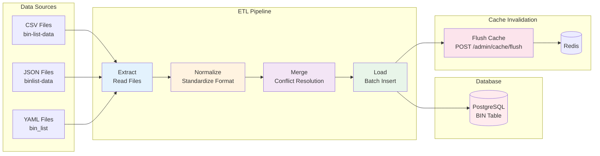

### 6.1. ETL Pipeline Stages

#### Stage 1: Extract
- **Input**: CSV, JSON, YAML files từ nhiều nguồn
- **Output**: Raw data objects
- **Features**:
  - Hỗ trợ nhiều format
  - Directory scanning
  - Error handling cho corrupted files

#### Stage 2: Normalize
- **Input**: Raw data objects
- **Output**: Standardized data objects
- **Features**:
  - Country code standardization (ISO 3166-1 alpha-2)
  - Issuer name normalization
  - Scheme/brand normalization (Visa, Mastercard, etc.)
  - Type normalization (Credit, Debit, Prepaid)
  - Confidence scoring

#### Stage 3: Merge
- **Input**: Normalized data từ nhiều nguồn
- **Output**: Merged data với conflict resolution
- **Features**:
  - Priority-based conflict resolution
  - Deduplication
  - Multi-source merging
  - Source tracking (provenance)

#### Stage 4: Load
- **Input**: Merged data
- **Output**: Database records
- **Features**:
  - Batch insert/update với transaction
  - Error handling và rollback
  - Progress tracking
  - Cache invalidation sau khi load

### 6.2. Conflict Resolution Logic

```typescript
// Pseudocode
function resolveConflict(existingData, newData, sourcePriority) {
  const conflicts = [];
  
  // Compare fields
  for (const field in newData) {
    if (existingData[field] !== newData[field]) {
      conflicts.push({
        field,
        existing: existingData[field],
        new: newData[field],
        source: newData.source
      });
    }
  }
  
  // Resolve based on priority
  const resolved = { ...existingData };
  for (const conflict of conflicts) {
    if (sourcePriority[conflict.source] > sourcePriority[existingData.source]) {
      resolved[conflict.field] = conflict.new;
      resolved.source = conflict.source; // Update provenance
    }
  }
  
  // If confidence < 70%, flag for manual review
  if (calculateConfidence(resolved) < 0.7) {
    await manualReviewQueue.add(resolved);
  }
  
  return resolved;
}
```

---

## 7. Kiến Trúc Cache Multi-Tier

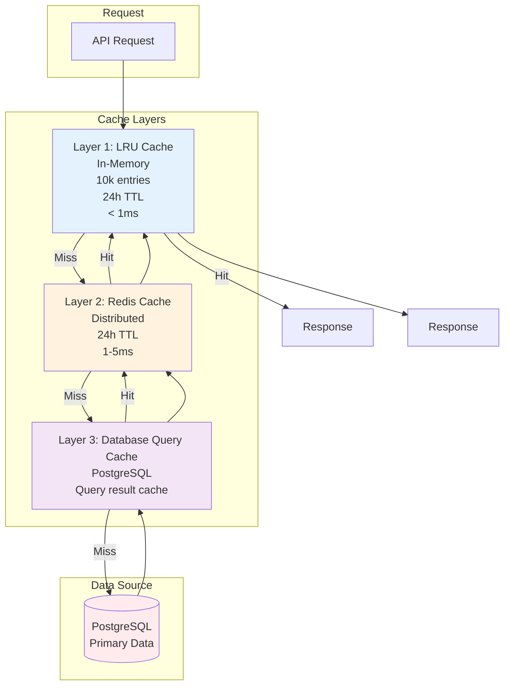

### 7.1. Cache Strategy

#### Cache-Aside Pattern
1. Application kiểm tra cache trước
2. Nếu cache hit → return data
3. Nếu cache miss → query database
4. Store result vào cache cho lần sau

#### Cache Invalidation
- **TTL-based**: Tự động expire sau 24 giờ
- **Event-based**: Flush cache sau ETL runs
- **Manual**: Admin có thể clear cache thủ công

#### Cache Warming
- Pre-load frequently accessed data vào cache
- Chạy sau khi server restart
- Chạy sau khi ETL completes

---

## 8. Kiến Trúc Bảo Mật

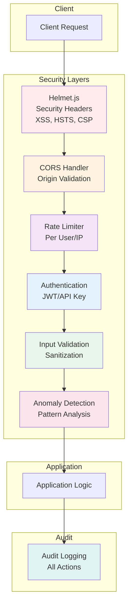

### 8.1. Security Features

#### 1. Helmet.js Security Headers
- **XSS Protection**: Ngăn chặn Cross-Site Scripting
- **HSTS**: Force HTTPS connections
- **CSP**: Content Security Policy
- **Frame Guard**: Ngăn clickjacking
- **No Sniff**: Ngăn MIME type sniffing

#### 2. CORS Configuration
- **Origin Whitelist**: Chỉ cho phép origins được cấu hình
- **Credentials**: Hỗ trợ cookies/credentials
- **Methods**: Chỉ cho phép methods cần thiết

#### 3. Rate Limiting
- **Per User**: Dựa trên user tier (Free, Basic, Premium, Enterprise)
- **Per IP**: Ngăn chặn abuse từ một IP
- **Sliding Window**: Time-based rate limiting

#### 4. Authentication
- **JWT Tokens**: Short-lived access tokens (15 minutes)
- **Refresh Tokens**: Long-lived refresh tokens (7 days)
- **API Keys**: For programmatic access
- **2FA**: Two-factor authentication support

#### 5. Input Validation
- **Sanitization**: Loại bỏ dangerous characters
- **Type Validation**: Kiểm tra kiểu dữ liệu
- **Schema Validation**: Validate theo schema (Joi, Zod)

#### 6. Anomaly Detection
- **Pattern Analysis**: Phát hiện patterns bất thường
- **Behavioral Tracking**: Theo dõi hành vi người dùng
- **Alert System**: Cảnh báo khi phát hiện anomalies

---

## 9. Kiến Trúc Database

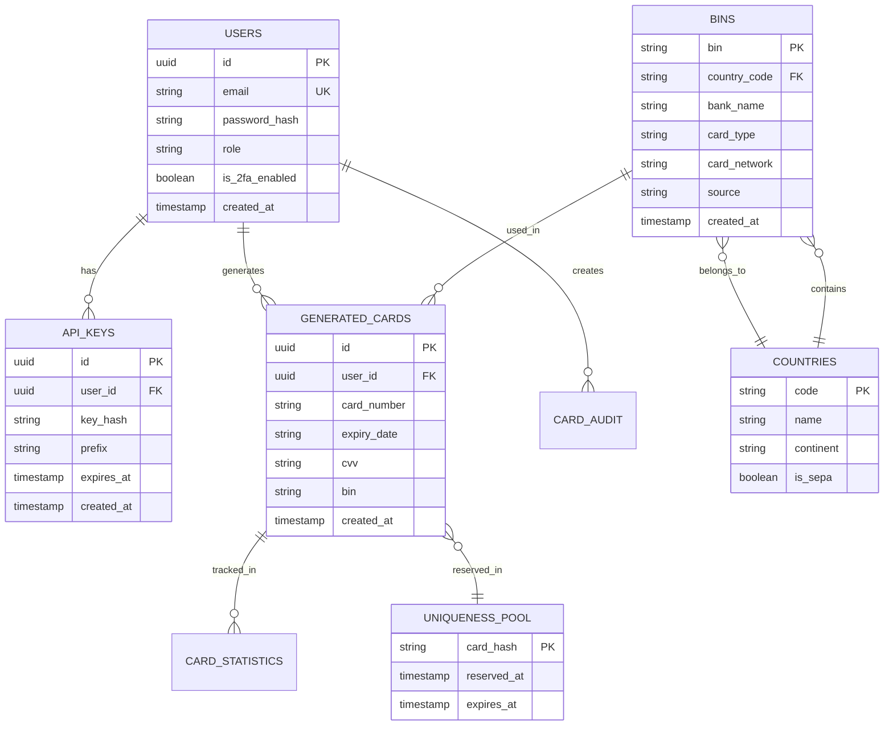

### 9.1. Database Schema Overview

#### Core Tables
- **users**: Thông tin người dùng, authentication
- **api_keys**: API keys cho programmatic access
- **bins**: BIN data từ nhiều nguồn
- **countries**: Thông tin quốc gia
- **generated_cards**: Cards đã được generate
- **card_statistics**: Thống kê về cards
- **card_audit**: Audit log cho card operations
- **uniqueness_pool**: Pool để reserve card hashes

#### Indexes
- **Primary Keys**: UUID cho users, cards
- **Unique Constraints**: Email, composite unique cho cards
- **Foreign Keys**: Relationships giữa tables
- **Performance Indexes**: BIN lookup, country codes, timestamps

#### Partitioning
- **Monthly Partitions**: Cho `generated_cards` table
- **Benefits**: Faster queries, easier archival

---

## 10. Các Thành Phần Chính

### 10.1. Services

#### BIN Service (`src/services/bin.ts`)
- **Chức năng**: BIN lookup, validation, search
- **Features**:
  - Multi-level caching
  - Batch lookup
  - Card network detection
  - Card type detection
  - Statistics aggregation

#### IBAN Service (`src/services/iban.ts`)
- **Chức năng**: IBAN validation, generation, parsing
- **Features**:
  - MOD-97 algorithm validation
  - Country-specific rules
  - Batch validation
  - Format conversion

#### Card Generation Service (`src/services/cardGeneration.ts`)
- **Chức năng**: Generate test credit cards
- **Features**:
  - Luhn algorithm validation
  - Multiple vendor support
  - Batch generation
  - Async job processing

#### Uniqueness Service (`src/services/uniquenessService.ts`)
- **Chức năng**: 5-layer uniqueness guarantee
- **Features**:
  - Multi-layer checking
  - Retry logic
  - Reservation system
  - Bloom filter integration

#### Cache Service (`src/services/multiTierCache.ts`)
- **Chức năng**: Multi-tier caching
- **Features**:
  - LRU cache management
  - Redis cache management
  - Cache warming
  - Cache invalidation

### 10.2. Middleware

#### Authentication Middleware (`src/middleware/auth.ts`)
- **Chức năng**: Xác thực JWT tokens và API keys
- **Features**:
  - Token validation
  - User extraction
  - Role checking

#### Rate Limiter Middleware (`src/middleware/rateLimit.ts`)
- **Chức năng**: Giới hạn số request
- **Features**:
  - Per-user limits
  - Per-IP limits
  - Tier-based limits
  - Redis-backed

#### Security Middleware (`src/middleware/security.ts`)
- **Chức năng**: Security enhancements
- **Features**:
  - Input sanitization
  - Anomaly detection
  - Security header validation

#### Validation Middleware (`src/middleware/validation.ts`)
- **Chức năng**: Request validation
- **Features**:
  - Schema validation
  - Type checking
  - Error formatting

### 10.3. Models

#### User Model (`src/models/user.ts`)
- **Chức năng**: User data operations
- **Features**:
  - CRUD operations
  - Password hashing
  - 2FA management
  - API key management

#### BIN Model (`src/models/bin.ts`)
- **Chức năng**: BIN data operations
- **Features**:
  - CRUD operations
  - Search với filters
  - Statistics queries
  - Source quality reporting

#### Card Model (`src/models/generatedCard.ts`)
- **Chức năng**: Card data operations
- **Features**:
  - CRUD operations
  - Uniqueness checking
  - Statistics aggregation

### 10.4. Workers

#### Card Generation Worker (`src/workers/cardGenerationWorker.ts`)
- **Chức năng**: Process card generation jobs
- **Features**:
  - Bull Queue integration
  - Parallel processing
  - Progress tracking
  - WebSocket updates

---

## 11. Luồng Dữ Liệu Chi Tiết

### 11.1. BIN Lookup Flow

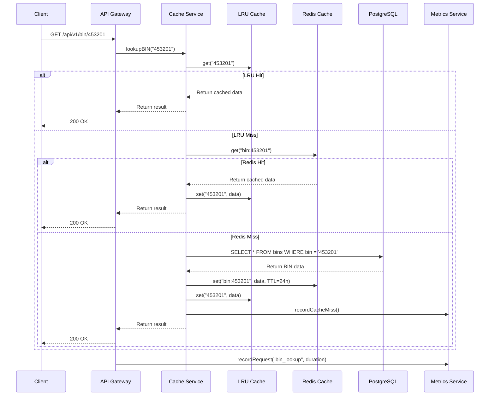

### 11.2. Card Generation Flow

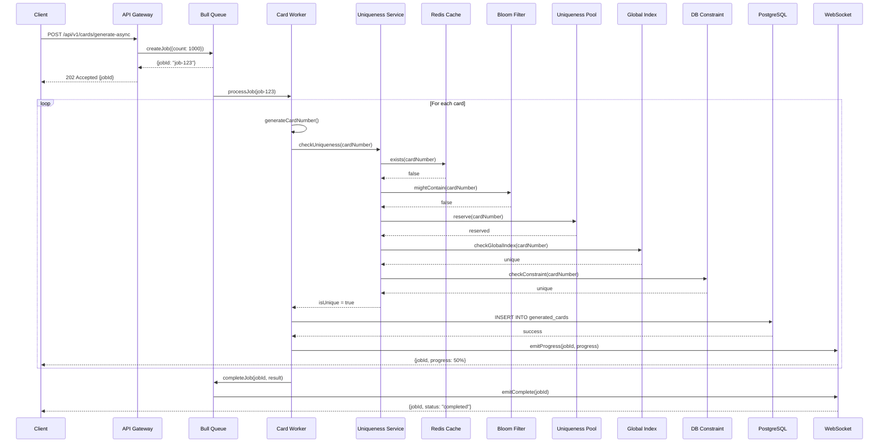

---

## 12. Monitoring và Observability

### 12.1. Metrics Endpoints

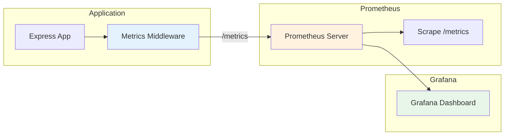

### 12.2. Metrics Collected

- **HTTP Metrics**:
  - `http_request_duration_seconds` - Request duration
  - `http_request_total` - Total requests
  - `http_request_errors_total` - Error count

- **BIN Metrics**:
  - `bin_lookup_total` - Total BIN lookups
  - `bin_lookup_duration_seconds` - Lookup duration
  - `bin_cache_hits_total` - Cache hits
  - `bin_cache_misses_total` - Cache misses

- **Card Metrics**:
  - `card_generation_total` - Total cards generated
  - `card_generation_duration_seconds` - Generation duration
  - `card_uniqueness_checks_total` - Uniqueness checks

- **System Metrics**:
  - `db_pool_active_connections` - Active DB connections
  - `cache_size` - Cache size
  - `redis_connections` - Redis connections

---

## 13. Deployment Architecture

### 13.1. Production Deployment

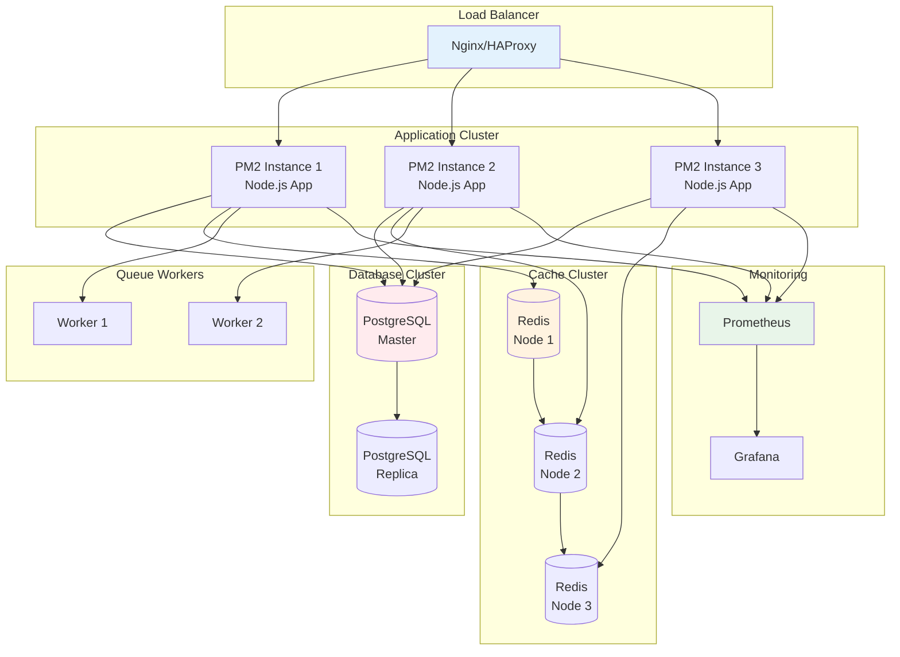

### 13.2. PM2 Configuration

- **Cluster Mode**: Multiple instances
- **Auto Restart**: Tự động restart khi crash
- **Log Management**: Log rotation
- **Memory Limit**: Giới hạn memory per instance
- **CPU Affinity**: Bind to specific CPUs

---

## 14. Kết Luận

### 14.1. Điểm Mạnh của Kiến Trúc

1. **Scalability**: Horizontal scaling với stateless design
2. **Performance**: Multi-tier caching, connection pooling
3. **Reliability**: 5-layer uniqueness guarantee, error handling
4. **Security**: Multi-layer security, authentication, authorization
5. **Observability**: Comprehensive metrics, logging, monitoring
6. **Maintainability**: Clean architecture, separation of concerns

### 14.2. Best Practices Được Áp Dụng

- **Separation of Concerns**: Routes, Controllers, Services, Models
- **Dependency Injection**: Loose coupling
- **Error Handling**: Centralized error handling
- **Logging**: Structured logging với correlation IDs
- **Testing**: Unit tests, integration tests
- **Documentation**: OpenAPI specification, inline documentation

### 14.3. Performance Targets

- **Response Time**: p95 < 50ms (cached requests)
- **Throughput**: 1000+ requests/second
- **Cache Hit Rate**: >95%
- **Card Generation**: 100K+ cards/hour
- **Uniqueness**: 100% guarantee

---

## Phụ Lục: Các File Quan Trọng

### A.1. Entry Point
- `src/index.ts` - Application entry point, server setup

### A.2. Configuration
- `src/config/index.ts` - Configuration management

### A.3. Routes
- `src/routes/*.ts` - API route definitions

### A.4. Controllers
- `src/controllers/*.ts` - Request handlers

### A.5. Services
- `src/services/*.ts` - Business logic

### A.6. Models
- `src/models/*.ts` - Database models

### A.7. Middleware
- `src/middleware/*.ts` - Express middleware

### A.8. Database
- `src/database/connection.ts` - Database connection
- `src/database/migrations/*.sql` - Database migrations

---

**Tài liệu này cung cấp cái nhìn toàn diện về kiến trúc hệ thống Payment Sandbox API. Để biết thêm chi tiết, xem các tài liệu khác trong thư mục `docs/`.**
