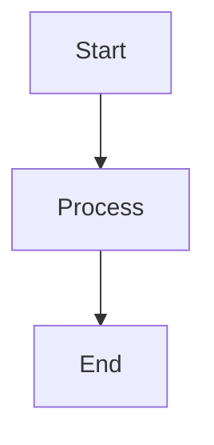
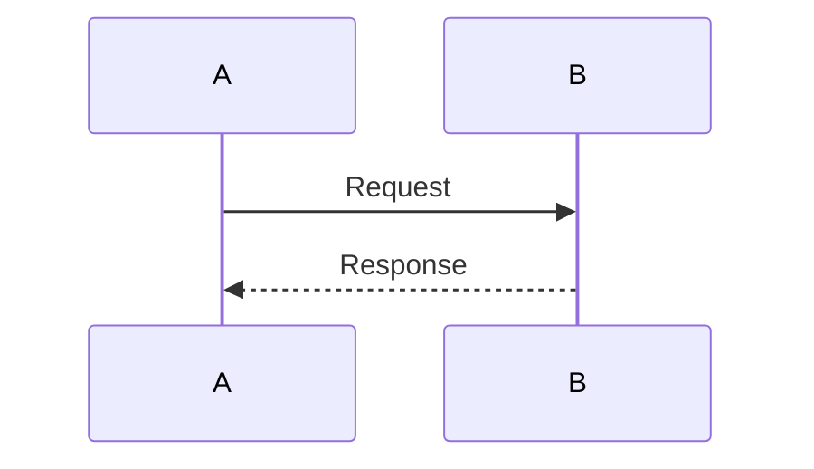
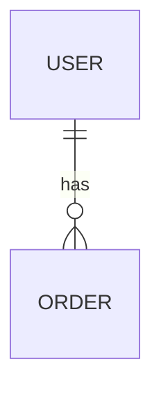

# Hướng Dẫn Sử Dụng Tài Liệu Kiến Trúc

## Tổng Quan

Bộ tài liệu kiến trúc hệ thống bao gồm:

1. **ARCHITECTURE_DIAGRAM.md** - Tài liệu chi tiết với Mermaid diagrams
2. **ARCHITECTURE_DIAGRAM_ASCII.md** - Sơ đồ ASCII art đơn giản
3. **ARCHITECTURE_README.md** - File này (hướng dẫn sử dụng)

---

## Cách Xem Sơ Đồ

### 1. Mermaid Diagrams (ARCHITECTURE_DIAGRAM.md)

#### Trên GitHub/GitLab
- Mermaid diagrams sẽ tự động render trên GitHub/GitLab
- Chỉ cần mở file `.md` trên web interface

#### Trên VS Code
- Cài extension: **Markdown Preview Mermaid Support**
- Mở preview (Ctrl+Shift+V) để xem diagrams

#### Trên Web
- Sử dụng [Mermaid Live Editor](https://mermaid.live/)
- Copy code từ file và paste vào editor

#### Trên Local với Node.js
```bash
# Cài đặt mermaid-cli
npm install -g @mermaid-js/mermaid-cli

# Generate PNG từ Mermaid file
mmdc -i docs/ARCHITECTURE_DIAGRAM.md -o docs/architecture-diagram.png
```

### 2. ASCII Art Diagrams (ARCHITECTURE_DIAGRAM_ASCII.md)

- Xem trực tiếp trong text editor
- Hoặc in ra giấy để tham khảo
- Có thể copy vào terminal để xem với monospace font

---

## Cấu Trúc Tài Liệu

### ARCHITECTURE_DIAGRAM.md

Bao gồm các phần:

1. **Tổng Quan Kiến Trúc** - Giới thiệu tổng thể
2. **Sơ Đồ Kiến Trúc Tổng Quan** - Mermaid diagram tổng thể
3. **Luồng Xử Lý Request** - Sequence diagram
4. **Kiến Trúc BIN Lookup** - Flow diagram
5. **Kiến Trúc Card Generation** - 5-layer uniqueness
6. **Kiến Trúc ETL Pipeline** - Data processing flow
7. **Kiến Trúc Cache Multi-Tier** - Caching strategy
8. **Kiến Trúc Bảo Mật** - Security layers
9. **Kiến Trúc Database** - ER diagram
10. **Các Thành Phần Chính** - Services, Controllers, Models
11. **Luồng Dữ Liệu Chi Tiết** - Sequence diagrams
12. **Monitoring và Observability** - Metrics và monitoring
13. **Deployment Architecture** - Production setup

### ARCHITECTURE_DIAGRAM_ASCII.md

Bao gồm các sơ đồ ASCII art tương ứng với các phần trong file chính:

1. Kiến trúc tổng quan
2. Luồng xử lý request
3. Kiến trúc BIN lookup
4. Kiến trúc card generation
5. Kiến trúc ETL pipeline
6. Kiến trúc cache multi-tier
7. Kiến trúc bảo mật
8. Deployment architecture
9. Luồng dữ liệu ETL
10. WebSocket real-time updates

---

## Đối Tượng Sử Dụng

### Developers
- Hiểu cách hệ thống hoạt động
- Tìm hiểu flow của các tính năng
- Debug và troubleshoot
- Onboarding cho developers mới

### Architects
- Review kiến trúc
- Planning cho scaling
- Design decisions
- Performance optimization

### DevOps Engineers
- Hiểu deployment architecture
- Setup monitoring
- Configure infrastructure
- Troubleshoot production issues

### Product Managers
- Hiểu capabilities của hệ thống
- Planning features
- Technical discussions với team

---

## Các Tính Năng Được Mô Tả

### 1. Authentication & Authorization
- JWT authentication
- API key management
- 2FA support
- Role-based access control

### 2. BIN Lookup
- Multi-tier caching (LRU, Redis, Database)
- Search và filtering
- Statistics aggregation

### 3. IBAN Validation
- MOD-97 algorithm
- Country-specific rules
- Batch validation
- Generation và parsing

### 4. Card Generation
- 5-layer uniqueness guarantee
- Async job processing
- WebSocket real-time updates
- Batch generation

### 5. ETL Pipeline
- Extract từ nhiều nguồn (CSV, JSON, YAML)
- Normalize và standardize
- Merge với conflict resolution
- Load vào database

### 6. Caching Strategy
- 3-tier caching (LRU, Redis, Database)
- Cache warming
- Cache invalidation
- Performance optimization

### 7. Security
- Multi-layer security
- Rate limiting
- Input validation
- Anomaly detection
- Audit logging

### 8. Monitoring
- Prometheus metrics
- Health checks
- Structured logging
- Performance tracking

---

## Cách Đọc Sơ Đồ

### Mermaid Diagrams

#### Graph Diagrams

- **graph TB**: Top to Bottom
- **graph LR**: Left to Right
- **graph TD**: Top Down (same as TB)

#### Sequence Diagrams

- **->>**: Solid arrow (request)
- **-->>**: Dashed arrow (response)

#### ER Diagrams

- **||--o{**: One-to-many relationship

### ASCII Art Diagrams

- Đọc từ trên xuống dưới
- Mũi tên (→, ↓, ↑) chỉ hướng flow
- Boxes đại diện cho components
- Lines kết nối các components

---

## Cập Nhật Tài Liệu

Khi có thay đổi trong kiến trúc:

1. **Cập nhật Mermaid diagrams** trong `ARCHITECTURE_DIAGRAM.md`
2. **Cập nhật ASCII art** trong `ARCHITECTURE_DIAGRAM_ASCII.md`
3. **Cập nhật giải thích** nếu có thay đổi logic
4. **Review** với team trước khi commit

### Tools Hữu Ích

- **Mermaid Live Editor**: https://mermaid.live/
- **ASCII Art Generator**: https://www.ascii-art.de/
- **Draw.io**: https://app.diagrams.net/ (cho diagrams phức tạp)

---

## Liên Kết Tài Liệu Khác

Các tài liệu liên quan:

- `docs/ARCHITECTURE_UNIQUENESS.md` - Chi tiết về 5-layer uniqueness
- `docs/architecture/data-flow-diagram.md` - Data flow chi tiết
- `docs/architecture/security-model.md` - Security model
- `docs/architecture/scalability-design.md` - Scalability design
- `docs/DEPLOYMENT_GUIDE.md` - Hướng dẫn deployment
- `docs/OPERATIONAL_RUNBOOKS.md` - Operational procedures
- `README.md` - Tổng quan dự án

---

## FAQ

### Q: Làm sao để export diagrams thành hình ảnh?

**A**: Sử dụng mermaid-cli:
```bash
npm install -g @mermaid-js/mermaid-cli
mmdc -i docs/ARCHITECTURE_DIAGRAM.md -o output.png
```

### Q: Có thể chỉnh sửa diagrams không?

**A**: Có, chỉnh sửa code Mermaid trong file `.md`. Diagrams sẽ tự động render lại.

### Q: ASCII art có cần cập nhật khi thay đổi Mermaid?

**A**: Không bắt buộc, nhưng nên cập nhật để đồng bộ. ASCII art hữu ích khi không có công cụ render Mermaid.

### Q: Làm sao để thêm diagram mới?

**A**: 
1. Thêm Mermaid code vào `ARCHITECTURE_DIAGRAM.md`
2. Thêm ASCII art tương ứng vào `ARCHITECTURE_DIAGRAM_ASCII.md`
3. Thêm giải thích chi tiết

### Q: Diagrams có thể dùng trong presentation không?

**A**: Có, có thể:
- Export Mermaid thành PNG/SVG
- Hoặc screenshot từ Mermaid Live Editor
- Hoặc sử dụng ASCII art trực tiếp

---

## Support

Nếu có câu hỏi hoặc cần hỗ trợ:

1. Xem các tài liệu khác trong `docs/`
2. Xem code comments trong source code
3. Liên hệ team development

---

**Cập nhật lần cuối**: 2024  
**Phiên bản tài liệu**: 1.1.0
