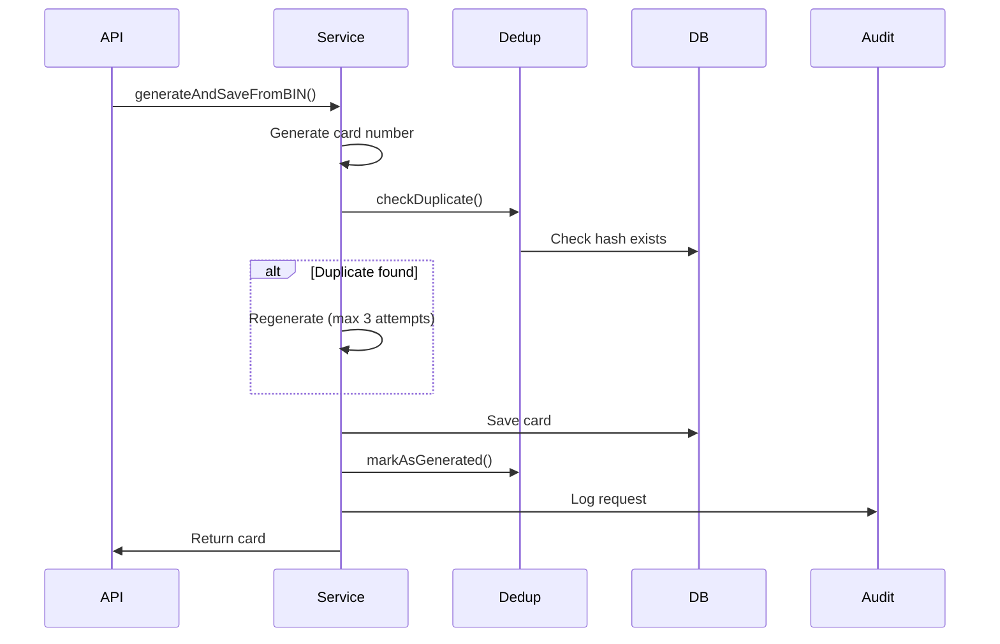

# Card Generation Storage Architecture

## Overview

The card generation feature has been enhanced with comprehensive storage, deduplication, and audit logging capabilities. This document describes the architecture, database schema, and operational procedures.

## Database Schema

### `generated_cards` Table (Partitioned)

Stores all generated card numbers with full metadata and deduplication support.

**Key Features:**
- **Partitioned by date** (`generation_date`) for scalability
- **Hash-based deduplication** using `card_hash` (SHA-256 of card_number+expiry+cvv)
- **Denormalized BIN metadata** for fast queries without joins
- **Request context tracking** (user_id, api_key_id, request_id)

**Schema:**
```sql
CREATE TABLE generated_cards (
  id UUID PRIMARY KEY,
  card_number VARCHAR(19) NOT NULL,
  bin VARCHAR(8) NOT NULL,
  expiry_date VARCHAR(5) NOT NULL, -- MM/YY
  expiry_month VARCHAR(2) NOT NULL,
  expiry_year VARCHAR(2) NOT NULL,
  cvv VARCHAR(4) NOT NULL,
  bank_name VARCHAR(255),
  country_code CHAR(2),
  card_type VARCHAR(20),
  card_network VARCHAR(50),
  generation_mode VARCHAR(20) NOT NULL, -- 'random', 'sequential', 'batch_999'
  sequence_number BIGINT,
  is_sequential BOOLEAN DEFAULT FALSE,
  user_id UUID REFERENCES users(id),
  api_key_id UUID REFERENCES api_keys(id),
  request_id VARCHAR(255),
  card_hash VARCHAR(64) NOT NULL UNIQUE, -- SHA-256 hash
  generated_at TIMESTAMP WITH TIME ZONE DEFAULT CURRENT_TIMESTAMP,
  created_at TIMESTAMP WITH TIME ZONE DEFAULT CURRENT_TIMESTAMP,
  generation_date DATE NOT NULL DEFAULT CURRENT_DATE
) PARTITION BY RANGE (generation_date);
```

**Indexes:**
- `idx_generated_cards_bin` - Fast BIN lookups
- `idx_generated_cards_user_id` - User-specific queries
- `idx_generated_cards_card_hash` - Deduplication checks
- `idx_generated_cards_generation_date` - Partition pruning
- `idx_generated_cards_generation_mode` - Mode-based analytics

### `card_generation_statistics` Table

Daily aggregated statistics for card generation.

**Schema:**
```sql
CREATE TABLE card_generation_statistics (
  id UUID PRIMARY KEY,
  date DATE NOT NULL UNIQUE,
  total_generated BIGINT DEFAULT 0,
  total_unique BIGINT DEFAULT 0,
  total_duplicates BIGINT DEFAULT 0,
  random_count BIGINT DEFAULT 0,
  sequential_count BIGINT DEFAULT 0,
  batch_999_count BIGINT DEFAULT 0,
  bins_used INTEGER DEFAULT 0,
  top_bins JSONB, -- {bin: count}
  countries_used INTEGER DEFAULT 0,
  top_countries JSONB, -- {country_code: count}
  users_active INTEGER DEFAULT 0,
  top_users JSONB, -- {user_id: count}
  avg_generation_time_ms DECIMAL(10,2),
  p95_generation_time_ms DECIMAL(10,2),
  p99_generation_time_ms DECIMAL(10,2),
  created_at TIMESTAMP WITH TIME ZONE DEFAULT CURRENT_TIMESTAMP,
  updated_at TIMESTAMP WITH TIME ZONE DEFAULT CURRENT_TIMESTAMP
);
```

### `card_generation_audit` Table

Audit trail for all card generation API requests.

**Schema:**
```sql
CREATE TABLE card_generation_audit (
  id UUID PRIMARY KEY,
  user_id UUID REFERENCES users(id),
  api_key_id UUID REFERENCES api_keys(id),
  endpoint VARCHAR(100) NOT NULL,
  method VARCHAR(10) NOT NULL,
  request_body JSONB,
  request_params JSONB,
  cards_generated INTEGER NOT NULL,
  generation_mode VARCHAR(20),
  bin_used VARCHAR(8),
  response_time_ms INTEGER,
  status_code INTEGER,
  ip_address INET,
  user_agent TEXT,
  request_id VARCHAR(255),
  created_at TIMESTAMP WITH TIME ZONE DEFAULT CURRENT_TIMESTAMP
);
```

## Deduplication Strategy

### Multi-Level Deduplication

1. **Pre-generation Check (Cache)**
   - In-memory LRU cache (10,000 entries, 1-hour TTL)
   - Key: `card_hash` (SHA-256 of card_number+expiry+cvv)
   - Fast lookup before generating card

2. **Database Check**
   - Unique constraint on `card_hash`
   - Prevents duplicate inserts
   - Handles race conditions

3. **Post-generation Marking**
   - Cards marked in cache after successful generation
   - Prevents immediate duplicates

### Hash Calculation

```typescript
function calculateCardHash(cardNumber: string, expiryDate: string, cvv: string): string {
  const data = `${cardNumber}|${expiryDate}|${cvv}`;
  return crypto.createHash('sha256').update(data).digest('hex');
}
```

## Card Generation Flow

### Single Card Generation



### Batch Generation (999 cards)

1. Generate all 999 cards
2. Batch check for duplicates
3. Filter out duplicates
4. Batch insert remaining cards
5. Mark all in cache
6. Log to audit

## Statistics Aggregation

### Real-Time Statistics

Calculated on-demand from `generated_cards` and `card_generation_audit` tables.

**Endpoints:**
- `GET /api/v1/cards/statistics` - Today's real-time stats
- `GET /api/v1/cards/statistics/bin/:bin` - Stats for specific BIN

### Daily Aggregation

Run daily at 00:00 UTC via cron job:

```bash
npm run stats:aggregate [YYYY-MM-DD]
```

**Process:**
1. Query `generated_cards` for the target date
2. Aggregate by mode, BIN, country, user
3. Calculate performance metrics from `card_generation_audit`
4. Upsert into `card_generation_statistics`

## Database Partitioning

### Monthly Partitions

The `generated_cards` table is partitioned by `generation_date` for scalability.

**Create Partitions:**
```bash
# Create partitions for next 3 months
npm run partition:create 3

# List all partitions
npm run partition:list

# Archive old partitions (keep last 12 months)
npm run partition:archive 12
```

**Partition Naming:**
- Format: `generated_cards_YYYY_MM`
- Example: `generated_cards_2024_01`

**Benefits:**
- Faster queries (partition pruning)
- Easier data archival
- Better maintenance (drop old partitions)

## API Usage

### Generate and Save Card

```typescript
// Single card
const card = await CardGenerationService.generateAndSaveFromBIN({
  bin: '453212',
  expiryMonths: 12,
  sequential: false,
  userId: 'user-123',
  apiKeyId: 'key-456',
  requestId: 'req-789',
});

// Multiple cards
const cards = await CardGenerationService.generateAndSaveMultipleFromBIN({
  bin: '453212',
  count: 5,
  sequential: true,
  startSequence: 0,
  userId: 'user-123',
});

// 999 cards with CVV variants
const cards = await CardGenerationService.generateAndSave999CardsWithCVV({
  bin: '453212',
  expiryMonths: 12,
  userId: 'user-123',
});
```

### Query Generated Cards

```typescript
// By user
const result = await generatedCardModel.findByUserId('user-123', 50, 0);

// By BIN
const result = await generatedCardModel.findByBin('453212', 50, 0);

// Check if card exists
const exists = await generatedCardModel.existsByHash(cardHash);
```

## Performance Considerations

### Indexes

All queries are optimized with appropriate indexes:
- BIN lookups: `idx_generated_cards_bin`
- User queries: `idx_generated_cards_user_id`
- Date range queries: `idx_generated_cards_generation_date`

### Batch Operations

- Use `createBatch()` for multiple cards (reduces round trips)
- Batch deduplication check before insert
- ON CONFLICT DO NOTHING for idempotency

### Caching

- LRU cache for deduplication (10K entries, 1h TTL)
- Cache hit rate should be >80% for high-volume scenarios

## Monitoring

### Key Metrics

1. **Generation Rate**
   - Cards generated per day/hour
   - By generation mode

2. **Deduplication Rate**
   - Duplicate detection rate
   - Cache hit rate

3. **Performance**
   - Average generation time
   - P95/P99 response times

4. **Storage Growth**
   - Cards per partition
   - Partition sizes

### Queries

```sql
-- Daily generation count
SELECT generation_date, COUNT(*) as count
FROM generated_cards
WHERE generation_date >= CURRENT_DATE - INTERVAL '30 days'
GROUP BY generation_date
ORDER BY generation_date DESC;

-- Duplicate rate
SELECT 
  date,
  total_generated,
  total_duplicates,
  ROUND(total_duplicates::numeric / NULLIF(total_generated, 0) * 100, 2) as duplicate_rate_pct
FROM card_generation_statistics
ORDER BY date DESC
LIMIT 30;

-- Top BINs
SELECT bin, COUNT(*) as count
FROM generated_cards
WHERE generation_date >= CURRENT_DATE - INTERVAL '7 days'
GROUP BY bin
ORDER BY count DESC
LIMIT 10;
```

## Maintenance

### Daily Tasks

1. Run statistics aggregation: `npm run stats:aggregate`
2. Monitor duplicate rate
3. Check partition sizes

### Weekly Tasks

1. Create future partitions: `npm run partition:create 3`
2. Review top BINs and countries
3. Analyze performance trends

### Monthly Tasks

1. Archive old partitions: `npm run partition:archive 12`
2. Review storage growth
3. Optimize indexes if needed

## Security Considerations

1. **Card Hash Storage**
   - SHA-256 hash prevents reverse engineering
   - No plaintext card storage (if required by policy)

2. **Audit Trail**
   - All requests logged with user context
   - IP address and user agent tracked
   - Request ID for tracing

3. **Access Control**
   - All endpoints require authentication
   - Rate limiting applied
   - User-specific queries filtered

## Troubleshooting

### High Duplicate Rate

**Symptoms:** Many duplicate errors in logs

**Causes:**
- Cache not working properly
- High concurrency generating same cards
- Sequential generation with same startSequence

**Solutions:**
- Check cache statistics: `cardDeduplicationService.getCacheStats()`
- Increase cache size if needed
- Use random generation for high concurrency

### Slow Queries

**Symptoms:** Slow statistics or card lookups

**Causes:**
- Missing indexes
- Large partitions
- No partition pruning

**Solutions:**
- Verify indexes exist
- Check partition sizes
- Ensure date filters in queries

### Partition Creation Fails

**Symptoms:** Partition script errors

**Causes:**
- Partition already exists
- Invalid date range
- Database permissions

**Solutions:**
- Check existing partitions: `npm run partition:list`
- Verify date format (YYYY-MM-DD)
- Check database user permissions
